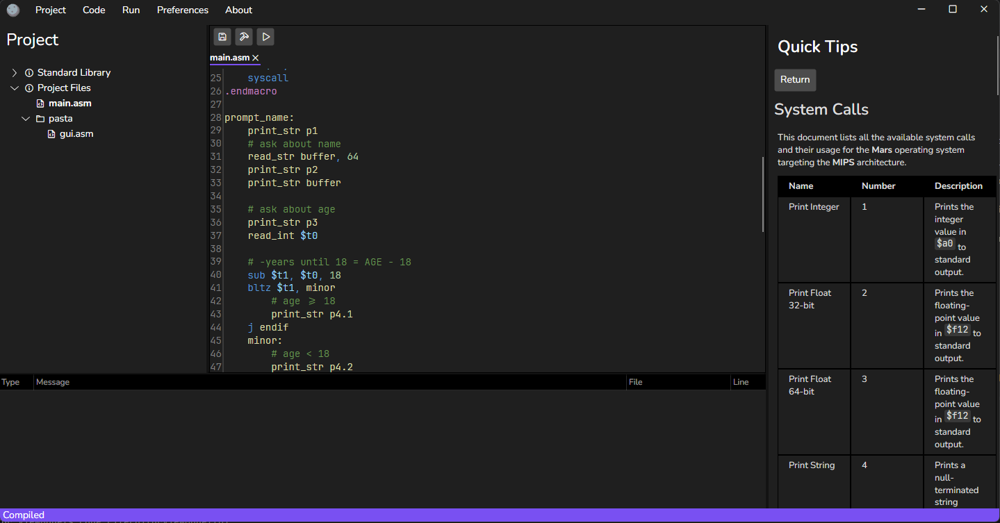
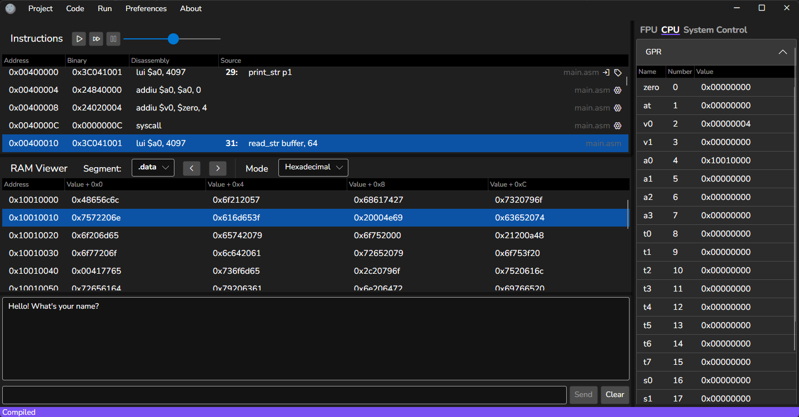

# Mercury

* Ler em [português](README.pt.md).

## What is Mercury?

Mercury is a flexible framework for instruction-accurate computer simulation.
Uses C# as a Domain Specific Language(DSL) to define an architecture details and instructions. 
Enables description of any* ISA and organizes a computer into different modules, decreasing the amount of 
work needed to add execution support to a ISA. Also, it includes an adaptive GUI with an embedded IDE to coordinate 
the compilation/loading/execution flow of programs.

*Currently only 32 fixed width instructions are supported. (i.e. MIPS, Arm(except Thumb), etc.)

> [!NOTE]
> This project is product of my graduation thesis. Available [here](https://repositorio.ufsm.br/bitstream/handle/1/37299/Appelt_Rodrigo_2025_TCC.pdf).

## How Does It Work?

Mercury is split in many different parts, each with its own set of responsabilities. In order of usage: 
1. **ISA Definition:** uses C# as a DSL to embed metadata about registers and instructions in the source code
2. **Specific Module Implementation:** for new ISAs, a CPU module is needed. This module defines the behaviour of each 
instruction defined in the previous step.
3. **Machine Modeling:** instantiation of modules that define which capabilities the final virtual computer will have.
These modules communicate between themselves via a publish-subcribe event bus.
4. **Execution Analysis:** using the GUI application, programs can be compiled/loaded and its execution analyzed in a 
step-by-step manner with instruction side-effects clear.

## Modules

There are a variety of pre-implemented modules that can be used:
1. A MIPS-I CPU module with optional branch delay slot simulation.
2. Optimized RAM module (complete 64-bit address), can save state to disk
3. MIPS Syscall Provider: has most syscalls supported by MARS (and by extension SPIM)

## GUI Application

The GUI application (referred as Editor) is a cross-platform user-friendly interface that
hosts an embedded IDE so the user can create its own programs in an immersive way. Also,
it automates some processes, such as compilation, assembling, linking and loading. 
In addition, it abstracts details from the underlying framework, selecting different modules 
based on current project settings. Finally, it exposes a view for the user to execute 
the programs it has created and analyze program behaviour.

## Installation

Access the [Releases page](https://github.com/Agentew04/Mercury/releases) and download
the respective package:
* **Windows:** download the file `MercurySetup_VERSION_Windows.exe` to install. Subsequent 
updates are handled automatically by the application. 
  * For Portable installations, download `Mercury-VERSION.rar` and extract it to the desired folder. 
* **Linux:** download the file `MercurySetup_VERSION_Ubuntu.deb` to install